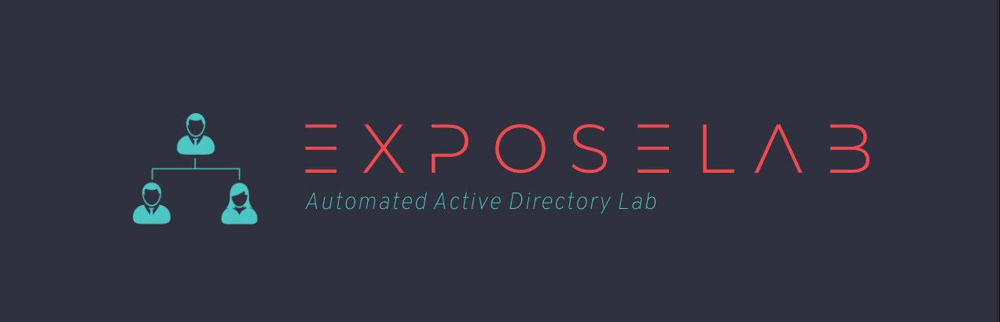
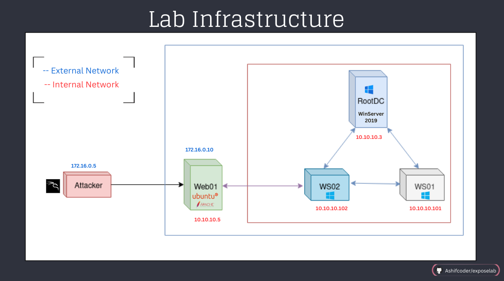

# Expose Lab: Automated Active Directory Lab + Mini CTF Inside!



## Lab Overview 💻

This lab is theamed after TV series MR.Robot :)
This is a  fully automated Active directory Lab made with the purpose to reduce the hustle of creating it manually. It uses Vagrant and Powershell Scripts to automate stuff.
It also contain a small CTF kind of senerio.

#### Lab preinstalled
- Active directory Services.
- Chocholotary (firefox, 7zip, Notepad++ ).
- Internal Network (for Tunnelling practice).
- sysinternals installed on every system.



### Installation Dependencies 📋
---
#### Virtual Box

Latest Version
https://www.virtualbox.org/wiki/Downloads

For version 6.1
https://www.virtualbox.org/wiki/Download_Old_Builds_6_1


### General update of the system

```sh
sudo apt-get update 
sudo apt-get install -y linux-headers-generic
```

#### Vagrant Installation

**Linux** ( Debian )
```sh
wget -O- https://apt.releases.hashicorp.com/gpg | gpg --dearmor | sudo tee /usr/share/keyrings/hashicorp-archive-keyring.gpg
```

```sh
echo "deb [signed-by=/usr/share/keyrings/hashicorp-archive-keyring.gpg] https://apt.releases.hashicorp.com $(lsb_release -cs) main" | sudo tee /etc/apt/sources.list.d/hashicorp.list
```

```sh
sudo apt update && sudo apt install vagrant
```


**Windows & Other Operating Systems**

visit https://developer.hashicorp.com/vagrant/downloads

## Installing plugins 

```sh
vagrant plugin install vagrant-windows-sysprep
```

---

## Building the lab Infrastructure

Build will take approximately ⏳
- Starting form scratch `2hr` .
- If the vagrant images are already downloaded  `50 min` . ( Grab a Coffee! ☕️ )

**Vagrant Cloud Images used**

```sh
# Vulnerable Web Server Machine [Ubuntu]
chrislentz/trusty64-lamp

# Domain Controller [Windows Server 2019]
rgl/windows-server-2019-standard-amd64

# Client Machies [Windows 10]
rgl/windows-10-1809-enterprise-amd64
```

## Video Tutorial 📹

1. Step by Step Installaion of the lab + code Explatation

🔗 https://youtu.be/zx4pJ2XewYo 


2. Solving the Mini CTF Challange!

🔗 https://youtu.be/d3QFLLOqefo


Making the lab

```sh
git clone https://github.com/Ashifcoder/exposelab.git
```
```sh
cd exposelab
```
```sh
vagrant up
```
Note: If IP address configuration allowed range Error occurs. Run the commands from the network troubleshooting section below.

#### Default Credentials

```sh
vagrant : vagrant 
```

Other Users on the Lab

User |  Machine | 
--|--|
mrrobot | RootDC
Angela | WebServer
Darlene | Windows Client 1
Tyrell | Windows Client 2
Elliot | N0t-F0uND

---

## Thing can be done manually

Run the remove-vagrant.ps1 as a Different user not as vagrant

or 

Run the commands Manually

```powershell
#-----------manually Command to run -----------

# Write Manually to disable the network of vagrant
Write-Host -ForegroundColor Green [-] Disabling the vagrent Network on the machine [-]

Get-NetAdapter ; Disable-NetAdapter -Name 'Ethernet' -Confirm:$False ; Write-Host -ForegroundColor Green "[+] Enabled" ; Get-NetAdapter

# Write Manually to remove the vagrant user from the system
Write-Host -ForegroundColor Green [-] Removing Vagrant User [-]
Remove-LocalUser -Name 'vagrant'

```

### To remove the virtualBox Boxes

```sh
vagrant destroy 
```

---
## Troubleshooting  ⚒

Network  Troubleshooting

Setting virtual box Networks
```sh
sudo vim /etc/vbox/networks.conf 
```

Should contain
```sh
* 10.0.0.0/8 192.168.0.0/16 195.0.0.0/8 172.16.0.0/8
* 2001::/64
```


# Disclaimer:
All the code provided on this repository is for educational/research purposes only. Any actions and/or activities related to the material contained within this repository is solely your responsibility. The misuse of the code in this repository can result in criminal charges brought against the persons in question. Author will not be held responsible in the event any criminal charges be brought against any individuals misusing the code in this repository to break the law.

## [GPL V3 License](LICENSE)


---

## Honourable Mentions 

- Video which inspried me : https://www.youtube.com/watch?v=HfOfbMXCQGM
- The Auror Project : https://github.com/chr0n1k/Auror-Project
- Website Landing page : https://github.com/Alanaktion/php-landing

#### Amazing websites:
- https://www.vagrantup.com
- https://learn.microsoft.com
- https://woshub.com
- https://chocolatey.org
